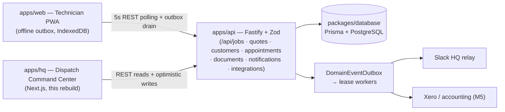
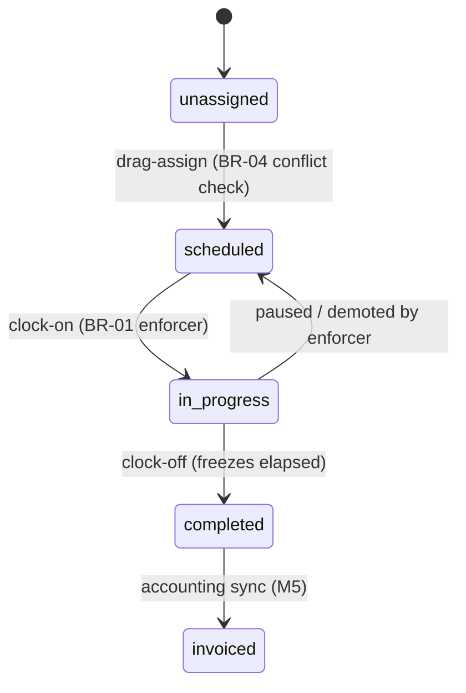

# PlumbTrack HQ — Application Map (Governing Blueprint v1)

> **Sources:** Arrivy architecture teardown + Arrivy UI/UX interaction-design pack (Aug 2026),
> reconciled against the codebase that actually exists (`apps/api`, `apps/web`, `packages/database`,
> `apps/dispatch` prototype). Where the research proposes and the repo already provides, **the repo wins**.
> **Status:** single source of truth for the HQ rebuild. Code defers to this map; map changes require a doc edit first.
> **Product one-liner:** PlumbTrack is the field execution layer for Caulfield South Plumbing —
> technicians capture trusted job records in the field; HQ orchestrates and answers exceptions.

---

## 1. Personas & Surfaces

| Persona | Surface | Core jobs-to-be-done | Status / milestone |
|---|---|---|---|
| Dispatcher | **`apps/hq`** — web command center | Assign work, watch live timers, resolve exceptions, share views | **M1 (this cycle)** |
| Technician | `apps/web` — mobile-first PWA | Run jobs offline, capture evidence, sign, invoice | built (extends per roadmap P1) |
| Customer | Portal (tracking/booking) | Book, track ETA, approve quotes | M4 (map only) |
| Back-office | `apps/web` views + integrations | Quotes → invoices → Xero; compliance | M3–M6 |

## 2. System Context (as-built + hq)

## 3. Domain Model — research ↔ repo reconciliation

The teardown's central **"Task"** entity maps onto what already exists — no parallel entity is created.

| Research concept | PlumbTrack implementation | Location |
|---|---|---|
| Task (job) | `Job` (id, status, customer/property link, photos, service items, signature) | `packages/database/prisma/schema.prisma` |
| Scheduling window | `Appointment` (window, assignment) | Prisma + `/api/appointments` |
| Timer / clock events | `TimeEntry { staffId, start, end, lat, lng }` — per-staff open/close entries | Prisma + `/api/jobs/:id/time-entries` |
| Crew / resource | Technician staff + vehicles (**gap**: no Crew aggregate yet) | gap register G-3 |
| Dynamic form | `Checklist`, `DailyReport`, RFIs (**gap**: no JSON-schema form engine) | gap register G-4 |
| Journal / timeline | `logEntries`, notifications feed | reducer + `/api/notifications` |
| Quote | `Quote { client, status draft→sent→accepted, lines }` + signature | Prisma + `/api/quotes` |
| Compliance docs | `PlumbDocument { category, expiresOn, versions }` | `/api/documents` |
| Webhooks out | `DomainEventOutbox → IntegrationDelivery` worker (Slack adapter exists) | `apps/api/src/domain/` |

**Job lifecycle (board-relevant states):**

**Quote lifecycle:** `draft → ready (client + ≥1 line) → sent (BR-02 gate) → accepted → invoiced`.
Rule already live in `apps/web` (`sendQuote` blocks empty templates) and `apps/api` schemas — HQ reuses the same rule client-side for instant feedback.

## 4. API Surface (existing) + Gap Register

**Existing (HQ consumes, never duplicates):** `/api/health`, `/api/jobs` (+ `:id/time-entries`, `:id/photos`, `:id/payment-link`), `/api/quotes`, `/api/customers` (+properties), `/api/appointments`, `/api/documents`, `/api/notifications`, `/api/integrations`, `/api/auth/device`. Auth: `Authorization: Bearer` session; `x-organization-id` is dev-only.

| # | Gap | Why | Milestone |
|---|---|---|---|
| G-1 | Board day-view feed (`GET /api/board?date=`) | one call for jobs+appointments+timers per day | M2 |
| G-2 | Assignment mutation (`PATCH /api/jobs/:id/assignment`) with server-side conflict validation | BR-04 server enforcement | M2 |
| G-3 | Crew aggregate (techs + vehicle + assets as one draggable entity) | multi-crew dispatch | M3 |
| G-4 | JSON-schema dynamic forms engine | compliance checklists, signatures | M3 |
| G-5 | Customer portal endpoints (public tracking token, quote approval) | M4 surfaces | M4 |
| G-6 | Routing/optimization service (CVRP cost fn: α·dist + β·time + γ·window-penalty) | SAL-style suggestions | M6 |

Until G-1/G-2 exist, `apps/hq` reads existing endpoints and performs **client-validated** writes with optimistic rollback (BR-07), seeded demo fallback when the API is down.

## 5. HQ Command Center Architecture

| Concern | Choice | Rationale (research → constraint) |
|---|---|---|
| Framework | Next.js 15 App Router (mirrors `apps/web` versions) | Server Components for dense reads; shared team knowledge |
| Styling | Tailwind v3, tokens below | consistent hierarchy, no CSS bloat |
| Components | shadcn/ui (repo-owned copies) + Lucide | accessible drag/date/multi-select primitives, keyboard nav |
| Server state | TanStack Query, 5s polling (mirrors web) | same freshness contract as field app |
| Interactive state | Zustand dispatch store — **normalized jobs dictionary (keyed by jobId, O(1) telemetry writes)** + vehicles + throttled `liveLocations` | 60fps board: timers, drags, selection, fleet stream |
| Real-time | `useTelemetrySocket()` — WSS `topic/jobs/status` + `topic/fleet/telemetry`, lodash-throttled (1s) ingest; polling fallback + demo simulator until the M2 gateway exists | remote status shifts re-color blocks with zero layout shift |
| Drag & drop | dnd-kit — per-slot droppables (`cell:techId:block`), custom collision (pointerWithin → rectIntersection) | exact-slot drops, validation during interaction |
| Map engine | MapLibre GL via react-map-gl — GeoJSON pins, dashed per-tech route LineStrings, symbol-layer vehicles rotated by streamed `heading` | live fleet movement, thousands-of-features headroom |
| Offline | IndexedDB (idb): jobs/customers cache + SyncQueue (LWW per job+op); offline mutations KEEP the optimistic state and queue; SW (`/sw.js`) background-sync drain | zero-connectivity dispatching groundwork |
| URL state | nuqs — `?date=&status=&priority=&skill=` | shareable board views (research: URL-as-state) |
| Validation | client-side now; Zod schemas shared with API in M2 | BR-02 instant feedback |
| Drag & drop | dnd-kit, constraint-aware (§6) | valid/invalid targets signaled at hover |
| Tests | Playwright, demo-mode deterministic | BR-01/02/04/07 + self-heal harness |

**Layout:** `apps/hq/src/{app,features,components/ui,stores,lib,hooks}` · package `@plumbtrack/hq` · port 3000 dev / 3200 test.

## 6. UI/UX Contracts (from the interaction-design pack)

### 6.1 View topology (toggleable canvas, one mental model per view)

| View | Optimized for | Milestone |
|---|---|---|
| **Resource matrix** (techs × 30-min blocks, Daily/Weekly/Monthly zoom) | capacity balancing, single-active timers, absence zones | **M1** |
| **List view** | bulk skimming, textual verification | **M1** |
| **Calendar** (vertical timeline) | temporal overlaps, daily gaps | **M1** |
| **Map** (schematic pins at real coords, van routes + travel ETA) | spatial logistics | **M1 (schematic)** → M4 live tiles |
| Gantt (dependencies, multi-day) | project sequencing | M6 |

### 6.2 Color semantics — the field agent's token system (apps/web is the design system)

HQ consumes the same Tier-1 tokens as the technician app — no parallel palette.
Chassis `#071022` void · chrome ramp `#1E56E0 / #4E8CFF / #B8D8FF` · Lato body +
JetBrains Mono uppercase labels.

| Signal | Token | Used for |
|---|---|---|
| Live timer / running job | **active teal** `#14B8A6` pulsing | the ONLY live-timer color |
| Interactive / selected / primary | chrome-600/400 ramp + machined gradient | buttons, selection ring, now-line |
| Emergency / expired / error | **urgent red** `#FF3B30` | never decorative |
| Expiring (≤30d) / queued attention | **pending amber** `#FF9F0A` | doc warnings |
| Complete / approved | **complete green** `#32D74B` | done jobs, signed quotes |
| Queued / muted sibling | fill/line etch + ink-low | everything not active |
| Technician identity | person-1..4 (dusty rose / sage / ochre / slate) | avatars, route lines |

All timestamps, timers, and money render `tabular-nums` (no jitter). Remote status changes shift block color/icon without reload (passive monitoring). App shell follows the Arrivy topology: sidebar modules (Dashboard, Dispatch, Calendar, Map live; Crews/Jobs/Customers/Forms/Reports gated to their milestones) with URL-mirrored module routing (`?module=`).

### 6.3 Interaction patterns

- **Pre-attentive job state (research §Visual Data Representation):** blocks signal status by color and icon before text — edge stripe + wash per status quartet, play/check/clock/siren iconography; remote status changes (5s poll) shift block color without reload.
- **Constraint-aware drag (slot-level):** while dragging over a skill-valid row, every 30-min cell lights chrome (free) or red-stripes (occupied, BR-04); skill-mismatched rows red-line whole-row with a blocked badge. Validation fires *during* interaction, not after drop.
- **Travel buffers (research §Spatial Routing):** consecutive located jobs render a striped transit band with the estimated drive time (haversine + city-speed heuristic); the band turns urgent when the estimate exceeds the scheduled gap — impossible transits surface themselves. Real drive-time matrices arrive with M6 (G-6).
- **Drop cascade (M2+):** drop → optimistic local assign → server PATCH → route re-optimize → push/SMS notifications. This cycle: local + rollback + toast.
- **One-tap status:** clock-on / clock-off / en-route are single oversized actions; no nested menus.
- **Optimistic UI + rollback (BR-07):** board mutates instantly; on API failure reverts and surfaces an error toast.
- **Filtering as noise reduction:** global filter popover (accordion categories: Status / Team-Role / Skills / Region / Job type / Priority / Availability), multi-select dimensions serialized as comma-separated URL params via nuqs; Team + Availability filter the technician Y-axis itself (rows hide, canvas declutters); active count badge + one-click clear.
- **Absence tracking:** approved leave renders as a hashed, un-droppable row zone (daily) / hashed cells (weekly-monthly); `canAssign` physically rejects drops with the leave reason; availability filter hides absent crews.
- **Rapid status overrides:** right-click a block → context-menu radio (Scheduled / En Route / In Progress / Delayed / Completed) at the cursor — no drill-down.
- **Conflict flagging:** every block derives overlap / skill / transit conflicts per render — pulsing urgent ring + hash overlay + warning icon, recomputed on remote (polled) updates with zero layout shift.
- **Linked multi-day schedules:** fragments share a `linkedGroupId`; blocks carry the link glyph and the drill-down lists all visits (fragment editor lands with M2's server-backed scheduling).
- **Quick-assign beacon:** picking up an unassigned card ranks crews (skill → availability → drive → load) and paints the BEST slot band on the optimal row, guiding the drag. Each suggestion carries its evidence chips (drive minutes from the crew's last site or the depot, skill match, on-leave/named disqualifiers, current load).
- **Route Optimizer card (reference: Arrivy Efficient Route):** toolbar slide-over with the reference configuration — scope (Unassigned / All tasks), max routes, max tasks per route, max duration per route — running a deterministic nearest-neighbour engine over the haversine travel matrix. Priority tiers first (emergency → high → normal), every leg reserves ≥1 travel block so canvas transit bands never render tight, and the whole day applies **atomically** (`applyRouteStops` validates the final layout — skills, absences, board-day bounds, per-row overlaps — before any mutation; offline routes queue per-stop in the SyncQueue). Overflow surfaces in an "unplaced" list with honest reasons, never silently dropped.
- **Availability panel (reference: Arrivy Powerful Filtering / Availability):** live per-crew bandwidth read-out (FREE from block / ON JOB / ON LEAVE with reason) derived from absences + same-day work; selecting an unassigned task turns it into a quick-assign surface (qualified free rows carry ASSIGN → first open slot).
- **Slack FSM bridge (research §Slack integration):** every store transition — drag-drop, context overrides, remote telemetry, optimizer applies — fans out to Block-Kit-style dispatch cards in the #dispatch-queue comms drawer: new task → ACCEPT TASK (claims via best-ranked crew), claim → rewritten + claimed-by chip, en_route → action closed + live ETA chip (telemetry position → travel estimate), on-site → temporary #job-{id} incident channel spins up, complete → field summary + channel archived. Inbound half: `/dispatch-status {jobId} {status}` and `/help` slash commands mutate the board from the chat line. Server side: `POST /api/slack/events` (Events Mode, disabled until `SLACK_VERIFICATION_TOKEN` is set, timing-safe token check, `accept_job_{id}` block actions, SSRF-allowlisted `response_url` rewrite) — the outbound queue/backoff worker already existed (`lib/integrationWorker.ts` + webhook relay).

### 6.4 Deferred patterns (documented for later milestones)

- Mobile HCI: oversized one-tap state buttons, native nav deep-links, offline optimistic capture (already implemented in `apps/web`).
- Customer portal: live tracking link (Uber-like), two-way messaging, post-job rating — M4.
- Cognitive offloading principle: the system computes validity; the dispatcher reacts to visual cues. Every new HQ feature must preserve this.

## 7. Business Rules Catalog (test-enforced)

| ID | Rule | Enforced today | Planned |
|---|---|---|---|
| BR-01 | **Single-Active Enforcer** — one `in_progress` timer per technician; fresh clock-on resets to 00:00:00 and demotes siblings | `apps/dispatch` store + Playwright | HQ store + API (M2) |
| BR-02 | **Quote gate** — no SENT without client + ≥1 line; only SENT → accepted | web reducer + API + Playwright | HQ + shared Zod (M2) |
| BR-03 | **Compliance windows** — doc amber ≤30d, red expired; expired mandatory doc blocks completion | vault UI | API enforcement (M2) |
| BR-04 | **Assignment constraints** — slot overlap rejection with reason | `apps/dispatch` `assignJob` | + skill matrix (M3), server-side (M2) |
| BR-05 | Route cost function (α·dist + β·time + γ·window penalty) | — | routing engine (M6) |
| BR-06 | Offline integrity — outbox, LWW + audit flags | `apps/web` outbox | mobile parity (M5) |
| BR-07 | Optimistic rollback on failed dispatch | — | **HQ this cycle** |

## 8. Screen Inventory

| # | Screen | Surface | Milestone |
|---|---|---|---|
| S1 | Dispatch Board (matrix + list, filters, day scrubber) | hq | **M1** |
| S2 | Job Inspector (timer, vault, quote, journal) | hq | **M1** |
| S3 | Unassigned Queue + Comms rail | hq | **M1** |
| S4 | Customers | hq | M2 |
| S5 | Quotes pipeline | hq | M2 |
| S6 | Compliance vault (company-wide) | hq | M2 |
| S7 | Crews & resources (skills, vehicles) | hq | M3 |
| S8 | Forms builder | hq | M3 |
| S9 | Customer portal (track/book/approve) | public | M4 |
| S10 | Analytics (route performance, CSAT) | hq | M6 |

## 9. Milestones & Acceptance

| # | Scope | Acceptance criteria |
|---|---|---|
| M1 | **This cycle** — `apps/hq` board on real API + demo fallback | matrix+list views; drag-assign w/ constraint feedback + rollback; enforcer, quote gate, vault; nuqs URLs; Playwright green incl. self-heal |
| M2 | Real persistence | G-1/G-2 endpoints; shared Zod; BR-04 server-side; calendar view |
| M3 | Crews & forms | G-3/G-4; skills in drag constraints |
| M4 | Customer portal | G-5; tracking + approvals |
| M5 | Accounting + payroll sync | Xero draft invoices from completed jobs |
| M6 | Intelligence | G-6 routing, ranked assignment suggestions (suggest-only; never auto-approve) |

## 10. Carry-Over Register (from `apps/dispatch` reference prototype)

- Zustand store: enforcer `clockOn`, conflict-checked `assignJob → {ok, reason}`, quote gate, `healTimer`/`forceQuoteDraft` bridge — **port current versions** (they include `scheduledDate` + overlap logic)
- Types + seed data (4 techs, 8 jobs, docs, channels), `lib/format.ts`
- Design tokens + `.glass`/`.tnum` CSS layer
- Playwright suite incl. `expectWithSelfHeal` harness

## 11. Conventions & Guardrails

- Naming `@plumbtrack/*`; env prefix `PLUMBTRACK_*` / `HQ_PUBLIC_API_URL`; secrets never in client code.
- Shared checkout: stage only your own hunks; no commits unless asked; `apps/web` is under active parallel work — do not touch.
- Auth boundary: bearer sessions in prod; org header dev/test only (matches `apps/api` contract).
- Out of scope (roadmap guard): commercial-construction features; AI never silently certifies/approves/alters signed records.
